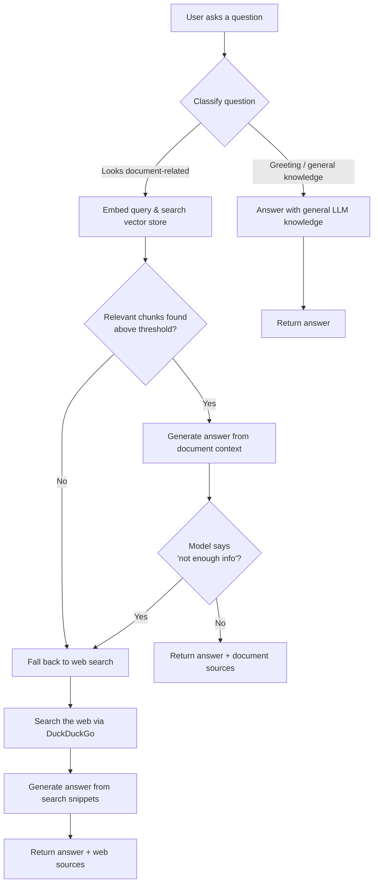

# RAG Knowledge Assistant

A local, privacy-friendly document Q&A assistant that runs entirely on your own machine using **Ollama**. Upload a PDF or TXT file, ask questions about it, and get answers grounded in the document. If the document doesn't have what you're looking for, it automatically falls back to a live web search instead of just saying "I don't know."

I built this because most RAG tutorials stop at "retrieve chunks, stuff them in a prompt" and don't handle the case where the document simply doesn't contain the answer. This one does — it degrades gracefully to general knowledge / web search rather than dead-ending the conversation.

---

## Why this project

I wanted something that behaved less like a rigid document search box and more like an actual assistant:

- If you ask something that's in your uploaded resume/PDF, it should answer strictly from that document — no hallucinated skills or made-up dates.
- If you ask something general ("what is Python?", "hi"), it shouldn't awkwardly try to force that into a document search.
- If you ask something document-shaped but the document genuinely doesn't cover it, it shouldn't just give up — it should go check the web.

Everything runs locally through Ollama, so there's no dependency on a paid LLM API for the core chat/embedding logic.

---

## Features

- 📄 Upload PDF / TXT files, auto-chunked and embedded into a local vector store
- 🧠 Local LLM inference and embeddings via **Ollama** — no API key needed
- 🔀 A router that classifies each question as `DOCUMENT` or `GENERAL` (rule-based first, LLM fallback for ambiguous cases)
- 🌐 Automatic web search fallback (via `ddgs` / DuckDuckGo) when the document doesn't have enough relevant context — or when the model itself says it can't find the answer
- 💬 Minimal, modern chat UI — no framework, just HTML/CSS/JS talking to a FastAPI backend
- 🏷️ Answers show their sources (document name, or web result links)

---

## How it works



The classification step uses a two-stage approach: a fast regex/keyword pass catches obvious cases (mentions of "resume," "skills," "candidate," etc.), and anything ambiguous gets routed through a small LLM classification prompt so it's not purely keyword-brittle.

---

## Tech stack

| Layer | Tool |
|---|---|
| LLM + embeddings | [Ollama](https://ollama.com) (local models) |
| Backend | FastAPI + Uvicorn |
| Vector store | Local vector store (Chroma-style) |
| Web search fallback | `ddgs` (DuckDuckGo search, no API key) |
| Frontend | Plain HTML / CSS / JS |

---

## Screenshots

> Add your own screenshots here once the app is running — a couple of the chat window (empty state + a real Q&A exchange) and one of the upload flow work well.

```
docs/screenshot-chat.png
docs/screenshot-upload.png
```

---

## Getting started

### 1. Prerequisites

- Python 3.10+
- [Ollama](https://ollama.com) installed and running
- Pull the models you're using, e.g.:
  ```bash
  ollama pull llama3
  ollama pull nomic-embed-text
  ```

### 2. Clone and install

```bash
git clone <your-repo-url>
cd rag-knowledge-assistant
pip install -r requirements.txt
```

Make sure `ddgs` is installed for the web search fallback:

```bash
pip install ddgs
```

### 3. Ingest a document (first run)

```bash
python -m app.ingest
```

### 4. Run the app

```bash
uvicorn app.main:app --reload
```

Then open `http://127.0.0.1:8000` in your browser.

---

## Project structure

```
rag-knowledge-assistant/
├── app/
│   ├── main.py          # FastAPI app, routes (/upload, /query)
│   ├── rag_chain.py      # Core RAG logic, router, web search fallback
│   ├── vector_store.py    # Vector store wrapper
│   ├── ingest.py          # Document ingestion / chunking / embedding
│   ├── config.py          # Model names, thresholds, top_k, etc.
│   └── static/
│       └── index.html     # Chat frontend
├── requirements.txt
└── README.md
```

---

## Configuration

A few things you can tune in `app/config.py`:

- `RAG_RELEVANCE_THRESHOLD` — how similar a chunk needs to be before it's considered "relevant." If this is too high, everything falls through to web search; too low, and irrelevant chunks get used.
- `TOP_K` — how many chunks to retrieve per query.
- `WEB_SEARCH_MAX_RESULTS` — how many web results to pull on fallback.
- `EMBEDDING_MODEL` / `CHAT_MODEL` — which Ollama models to use.

---

## Known limitations / things I'd improve next

- The document/general classifier is still partly regex-based — works well for resume-style documents, but would need retuning for other document types.
- No conversation memory yet — each question is answered independently.
- Web search fallback depends on DuckDuckGo being reachable; if it's rate-limited it fails soft with a plain message.

---

## License

MIT — feel free to fork and adapt this for your own use.
